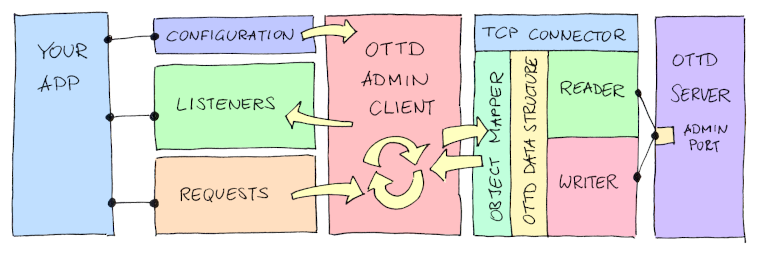

# OpenTTDAdmin
OpenTTD Admin Client Library + Integrations + Fully Functional App
Connects to the admin port of the OTTD and offers a Java-API for sending and receiving events to/from the OTTD server.

Overview
--------



Just focus of the business logic of your application and leave the networking stuff to the library.
- Receive notifications of the events you are interested in.
- Send requests to the server as you need them.
- Integrate with other tools of your choice.
    - Included Geolocation API
    - Included Slack integration
    - Included Google Translate API
- Use a logging framework of your choice - see [Slf4j](#slf4j).

New Project Structure
---------------------

Please note, with the version 1.3, the project has been restructured and partially renamed:
- The library itself is located under [OpenTTD Client](openttdclient/)
- Connectors to external services (GeoIP, Slack, Google etc.) are located under [Integrations](integrations/)
- A fully functional admin app got a new name **Genowefa** and is locates under [Genowefa](genowefa/)

Respective manuals are available in each project's main folder as a README file.

How To
------

- If you plan to build your own app, you just need the client library. Create an instance, configure it, register the listeners and you are done.
- If you want to use some extra features, like:
    - Looking up the geo location of client IP addresses, e.g. to identify proxies or to create customized welcome messages.
    - Translating international messages, e.g. to make it easier for people coming from all around the world.
    - Forwarding chat messages to a Slack channel and back to the game, e.g. to be 'always online' as an admin.
    you may use the [Integrations](integrations/) library to speed up the development.
- If you just want to have a ready-to-use admin tool, you may use [Genowefa](genowefa/) out of the box.

Demo App
--------
A simple app presenting how to use the library is to be found under [Demo](openttdclient/src/main/java/de/miltschek/openttdadmin/Demo.java). It shows on how to use all offered functions.
This is the default app that is started if you just execute the jar file.


<a name="slf4j">Slf4j</a>
-------------------------

The code makes use of the [Slf4j framework](https://www.slf4j.org/). It means, you may link it with virtually any logging engine of your choice.
If you just want to see the log output on the console, it's enough to add the `slf4j-simple-1.7.28.jar` library to the classpath (or whatever version will be valid at the time you use it).

Outside of an IDE environment, you may download the library from <https://repo1.maven.org/maven2/org/slf4j/slf4j-simple/>.

The Bolt library of Slack sets the default Log Level to ERROR. If you want to get another output level from the library itself, create a custom configuration or just add:

```
-Dorg.slf4j.simpleLogger.log.de.miltschek=debug
```

to the command line.

Development
-----------
The project is still under development. The basic idea stays stable. The "todo" comments indicate the areas that are about to change.
