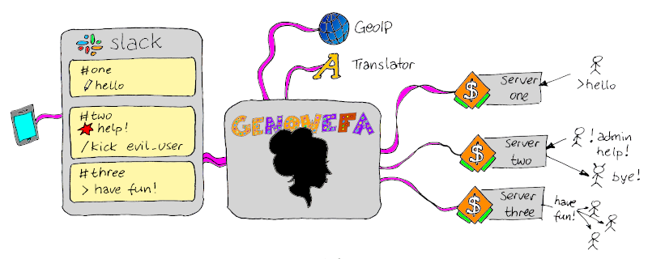

# Genowefa
A fully functional admin app ready to use out of the box:
- Connecting to a specified OpenTTD server.
- Looking up the geo location of client IP addresses to create customized welcome messages.
- Translating international messages, e.g. to make it easier for people coming from all around the world.
- Forwarding chat messages to a Slack channel and back to the game, e.g. to be 'always online' as an admin.



Caution
-------

The current development tree offers much more funtions than the last official release. The guidelines do not cover yet any of the new functions (database and web integration, multiple administrators support, deny lists etc.).


Building
--------

Either take a [pre-generated JAR file](https://github.com/miltschek/OpenTTDAdmin/releases/latest) or compile it by yourself. The project is Maven-enabled and this library depends on two other artifacts: the [OpenTTD Client](https://github.com/miltschek/OpenTTDAdmin/tree/main/ottdclient) and the [Integrations](https://github.com/miltschek/OpenTTDAdmin/tree/main/integrations). It means, the dependencies have to be built and installed in your Maven repository first to be able to build this app. To compile, make sure you use JDK 11 or newer and request the following build targets:
```
mvn clean compile package assembly:single
```

- `package` will create a genowefa-VERSION.jar file
- `assembly:single` will add dependencies to a genowefa-VERSION-jar-with-dependencies.jar file
- an optional `install` would register the library in your Maven repository, but this is not needed here

How-To
------

:new: Please note, the structure of the app has been significantly extended.

You may use an official release of the app (openttdclient-VERSION-jar-with-dependencies.jar) or compile it by your own:
- Make sure to install a JRE 11 or newer.
- Configure OpenTTD server(s) to accept admin connection with a password
- Set up Slack, if you like to get chat messages forwarding and remote control over the game
    - Create as many channels as many game servers you like to control (1 server = 1 channel)
    - Create a new Slack app accordingly to the instructions in the [Integrations How-To Slack (two-way)](https://github.com/miltschek/OpenTTDAdmin/tree/main/integrations), especially:
      - Enable the Socket Mode
      - Enable OAuth scopes (chat, reactions and channel list)
      - Enable Event Subscriptions
      - Enable Slash Commands (see below for details)
      - Install the App in the Workspace
      - Write down the tokens (app and bot) that are relevant for the configuration file of Genowefa (see below)
    - Invite the App to the channels
- Set up the Google Translate, if you like to offer the translate function (for the players and for you as admin)
    - Instructions to be found in the [Integrations How-To Google Translator](https://github.com/miltschek/OpenTTDAdmin/tree/main/integrations)
    - The path to the JSON key file is relevant for the configuration file of Genowefa (see below).
- The GeoIP functions will work automatically as no special account is needed for (ip-api.com)[https://ip-api.com]
- Create the configuration file `genowefa.json` (see below)
- Start the app with the following command line:

- Windows, without logging

```
C:\> java -jar genowefa-VERSION-jar-with-dependencies.jar
```

- Windows, with console logging

```
C:\> java -cp genowefa-VERSION-jar-with-dependencies.jar;slf4j-simple-1.7.30.jar -Dorg.slf4j.simpleLogger.log.de.miltschek=debug de.miltschek.genowefa.Main
```

- Linux, without logging

```
~$ java -jar ./genowefa-VERSION-jar-with-dependencies.jar
```

- Linux, with logging

```
~$ java -cp ./genowefa-VERSION-jar-with-dependencies.jar:./slf4j-simple-1.7.30.jar -Dorg.slf4j.simpleLogger.log.de.miltschek=debug de.miltschek.genowefa.Main
```

User's Manual
-------------

### Command line arguments

```
JAVA -jar genowefa-VERSION-jar-with-dependencies.jar [configuration_file_path]
```

- where `configuration_file_path` is an optional argument taking a path to Genowefa's configuration file
- per default, a configuration file is searched in the current working directory under the name `genowefa.json`
    
### Environment variables

The current version of Genowefa does not use any environment variables anymore.

### Configuration file

The Genowefa's configuration file, per default `genowefa.json` expected to be located in the current working directory, is a regular JSON file encoded as UTF-8.

**Please note**: an UTF-8-BOM format is not yet supported - the BOM leads to parse error during startup.

A template for a configuration file can be found [here](https://github.com/miltschek/OpenTTDAdmin/blob/main/genowefa/genowefa.json).

The configuration file consists of the following major sections:
- Slack credentials
- Google credentials
- OpenTTD game server(s)
- Internationalized welcome messages

```
{
  "slack": {
    ...
  },
  "google": {
    ...
  },
  "games": [
    ...
  ],
  "welcome_messages": [
    ...
  ]
}
```

#### Slack credentials
```
  "slack": {
    "app_token": "xapp-",
    "bot_token": "xoxb-"
  }
```

- A missing `slack` section or any of the keys turns off the Slack integration
- `app_token` is the app-level token, visible on the settings pages of the app under 'Your Apps' on Slack (starting with xapp-...)
- `bot_token` is the bot user OAuth token, visible on the OAuth settings pages of the app under 'Your Apps' on Slack (starting with xoxb-...)

#### Google credentials
```
  "google": {
    "key_file": "/home/user/google.json"
  }
```

- A missing `google` section or the key file path turns off the translation service
- `key_file` is a path to the JSON key file of the respective Google service, it can be absolute or relative to the current working directory

#### OpenTTD game server(s)
```
  "games": [
    {
      "address": "127.0.0.1",
      "port": 3977,
      "password": "PASSWORD",
      "slack_channel": "#one"
    },
    {
      "address": "192.168.1.20",
      "port": 3977,
      "password": "PASSWORD",
      "slack_channel": "#two"
    }
  ],
```

- `games` section is a list of game servers to be administered by Genowefa
- Each entry is a JSON object with following fields:
    - `address` is a network address of the OpenTTD game server (IPv4, IPv6, host name or FQDN)
    - `port` is a port number of the admin service of the OpenTTD game server as configured in the openttd.cfg under `[network]`: `server_admin_port`
    - `password` is a admin password as configured on the OpenTTD game server in the openttd.cfg file under `[network]`: `admin_password`
    - `slack_channel` is an optional parameter containing a Slack channel name (starting with a #) connecting this game server with this specific Slack channel

**Be careful** and don't use the same Slack channel for more than one game server as it would lead to funny unwanted effects like loops in message forwarding.

#### Internationalized welcome messages
```
  "welcome_messages": [
    {
      "country": "*",
      "message": "-> Warm welcome to ${USERNAME} coming from ${COUNTRY}! <-"
    },
    {
      "country": "DE",
      "message": "-> Moin moin, ${USERNAME} aus Deutschland! <-"
    },
    ...
  ]
}
```

- Each new player gets a personal welcome message when entering the game.
- The message is visible to all other players.
- The message can be customized for each country.
- `welcome_messages` is a list of JSON objects, each of them containing a template of a message specific to one country
- `country` is an [ISO 3166-1 alpha-2](https://en.wikipedia.org/wiki/ISO_3166-1_alpha-2) two-letter **UPPERCASE** code of a country
- A special identifier `*` for the `country` denotes a default message template if no specific one is available (fallback)
- Multiple entries with the same `country` identifier overwrite each other, so please take care not to duplicate them
- `message` is the welcome message template - it may contain variables that will be exchanged by the actual values:
    - `${USERNAME}` will be evaluated to the player name
    - `${COUNTRY}` will be evaluated to the country name (English spelling)
    - `${CITY}` will be evaluated to the city name (English spelling)
- A maximum length of the `message` is 899 bytes. Please note, UTF-8 characters may consume more that 1 byte. Please note, the message gets longer due to the evaluation of `${USERNAME}`, `${COUNTRY}` and `${CITY}`.
- Please note, the city name will be wrong in most cases, as it describes the location of the IP address (e.g. the location of the Internet provider) and not the actual location of the player.

### Slash Commands and Messages

Slash forwards messages and commands to the app only if configured to do so. Both are configurable on the settings pages under 'Your Apps' on Slack.

- Messages
    - Refer to [Integrations How-To Slack (two-way)](https://github.com/miltschek/OpenTTDAdmin/tree/main/integrations) to enable 'Event Subscriptions' and the event `message.channels`
	
- Commands
    - Refer to [Integrations How-To Slack (two-way)](https://github.com/miltschek/OpenTTDAdmin/tree/main/integrations) to enable 'Slash Commands'
    - Add a command `/date`: Gets the game's date.
    - Add a command `/getclients`: Gets a list of connected clients.
    - Add a command `/getcompanies`: Gets the list of active companies.
    - Add a command `/kickuser`: Kicks the user. Optional usage hint: User_ID \| IP_Address \[Reason\].
    - Add a command `/ban`: Bans a user. Optional usage hint: User_ID \| IP_Address \[Reason\].
    - Add a command `/pause`: Pauses the game.
    - Add a command `/unpause`: Continues the game.
    - Add a command `/setting`: Prints a setting's value or sets a new value. Optional usage hint: Setting_Name \[New_Value\].
    - Add a command `/resetcompany`: Resets a company. Optional usage hint: Company_ID.
    - Add a command `/quit`: Quits the game. Optional usage hint: confirmation.
      - This command will be executed only if the word `roger` is typed in as an argument. This is to avoid closing the game by a mistake, since you will not be able to start it again from Slack.

### Slack interaction

The app forwards to the specified channel the following data:
- :star: successful connection indication
- :boom: admin contact requests
- :recycle: information on company reset requests
- :name_badge: information on user name change requests
- :flags: translation requests results
- :exclamation: translation errors
- :pencil: non-empty chat messages from the players, including an optional :flags: translation (see Google Translate integration)
- :bust_in_silhouette: information on new players (id, name, network address, country, city and proxy-flag)
- :runner: information on disconnected players (if available, with :punch: the error reason)
- information on companies (:new: new, :office: changed, :hammer: removed)
- :checkered_flag: information whether a new game has been started
- :computer: commands results

Any message written to the Slack channel by another user will be forwarded to the game as a public message coming from the server.
**Caution**
Be careful not to create loops when configuring games and Slack channels.

### Interaction with Players

The app sends a welcome message to any new player in the game (including spectators):
1. A simple 'hello' message in many languages depending on the player's country (see the configuration file, section 'Internationalized welcome messages').
2. An additional, configurable welcome message, if available in the file `on_new_client.txt` in the current working directory.
   Just save your custom message encoded in UTF-8 in this file and it will be sent as a private chat to any new player.

### In-Game Commands

Players may request one of the following actions within the game:
- `!help` to get a list of supported commands
- `!admin <message>` to address a message to the game administrator (increased visibility with the :boom: emoji)
- `!reset` to remove the company the requesting user is currently playing
    The official implementation of the game requires all players to leave the company before it can be closed. That's why the players are kicked out of the game before the company gets closed. Unfortunately, there is no official command to change the role of the players to spectators, which would allow a nicer solution.
- `!dict <text>` to translate a message from any language into English

### Google Translate

If the Google Translation service is enabled, the application:
1. Forwards all public chat messages to the the translating service and - if recognized as a non-English text - is appended to the Slack notification.
2. Offers a translation service to the players, reacting on the `!dict` request (see In-Game Commands).

**Caution**
The Google Translation Service **does cost real money**. Please refer to the current price list.

### Geolocation

For the geographical location of a network address, the service of [ip-api.com](https://ip-api.com/) is used. There is no configuration needed.
For license details, see the project [Integrations](https://github.com/miltschek/OpenTTDAdmin/tree/main/integrations).
